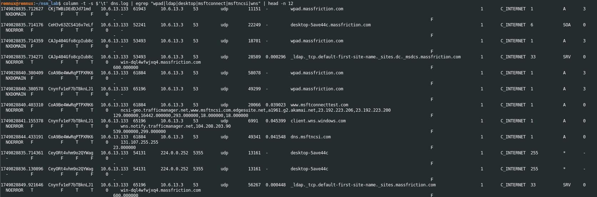
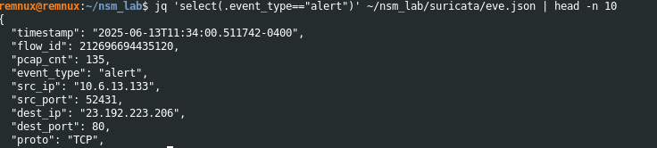

# Network Security Monitoring Case Study: Zeek & Suricata

## Overview
This case study documents my analysis of the 2025-06-13 “Traffic Analysis Exercise: It’s a Trap!” PCAP from malware-traffic-analysis.net. The file was renamed locally to `sample.pcap`. The work was carried out using Zeek 6.0 and Suricata 8.0.1 on a REMnux workstation. The goal was to demonstrate how protocol telemetry and signature based alerts combine to expose malicious behaviour such as WPAD abuse and anomalous HTTP flows, complementing host and SIEM visibility in the wider portfolio.

## Objectives
- Establish a repeatable offline workflow for Zeek and Suricata processing of network capture data.
- Identify malicious or suspicious patterns (WPAD, LDAP, HTTP beaconing) and filter them from legitimate Microsoft traffic.
- Correlate Zeek protocol logs with Suricata alerts to support investigative leads.
- Preserve artefacts, screenshots and commands for future reference and recruiter focused evidence.

## Environment and Tools
- Host platform: REMnux virtual machine made for network forensic analysis.
- Dataset: 2025-06-13-traffic-analysis-exercise.pcap from Malware-Traffic-Analysis.net (LAN segment 10.6.13.0/24, domain massfriction.com), locally renamed to `~/nsm_lab/pcaps/sample.pcap`. Source: https://www.malware-traffic-analysis.net/2025/06/13/index.html
- Analysis tools: Zeek 6.0, Suricata 8.0.1, and Unix utilities (jq, column, egrep, head, mkdir).
- Evidence structure: Directories `./artefacts/` and `./screenshots/` captured key logs and images referenced throughout.

## Workflow (commands)
1. Zeek parsing of the capture.
   ```bash
   mkdir -p zeek
   cd zeek
   zeek -r ../pcaps/sample.pcap -C
   ```
   Generated detailed protocol logs while preserving packet checksums.
2. DNS telemetry filtering for suspect domains.
   ```bash
   column -t -s $'\t' dns.log | egrep "wpad|ldap|desktop|msftconnect|msftncsi|wns" | head -n 12
   ```
3. Suricata workspace preparation.
   ```bash
   mkdir -p ~/nsm_lab/suricata
   ```
4. Replay capture through Suricata.
   ```bash
   suricata -r ~/nsm_lab/pcaps/sample.pcap -l ~/nsm_lab/suricata
   ```
5. Extract alert metadata for correlation.
   ```bash
   jq 'select(.event_type=="alert") | {time:.timestamp, sig:.alert.signature, src:.src_ip, dst:.dst_ip, proto:.proto}' \
     ~/nsm_lab/suricata/eve.json | head -n 10
   ```
6. Archive key evidence.
   - Captured log excerpts to `./artefacts/`
   - Documented findings and screenshots in `./screenshots/`

## What Actually Happened
- Suricata rule and logging configuration proved the most difficult phase; multiple iterations were required to generate actionable alerts.
- Zeek generated heavy data volumes; the turning point came when I applied keyword filtering to DNS logs (WPAD and LDAP) and found clear anomalies.
- I developed a deeper understanding of how network level telemetry underpins detection workflows; the insights from this lab shaped my subsequent SIEM analysis.
- Completing this phase provided a solid foundation for the next lab in my SOC triad portfolio.

## Key Findings
- WPAD lookups to `wpad.massfriction.com` were observed in Zeek DNS logs, suggesting proxy auto-discovery abuse.  
  
- `_ldap._tcp` SRV queries from the host revealed probable Active Directory reconnaissance.  
- Suricata flagged outbound HTTP traffic from `10.6.13.133` to `23.192.223.206:80`, reinforcing suspicion of exfiltration behaviour.  
  
- Legitimate Microsoft connectivity checks (msftconnecttest.com, dns.msftncsi.com, wns.windows.com) were present and documented to avoid mis-attribution of benign flows.

## MITRE ATT&CK Mapping
| Technique                            | ID        | Evidence                                                                                  |
|-------------------------------------|-----------|-------------------------------------------------------------------------------------------|
| Application Layer Protocol DNS       | T1071.004 | WPAD lookups in Zeek DNS logs (`./screenshots/02-zeek-dnslog.png`)                        |
| Remote System Discovery              | T1018     | LDAP SRV query observed (`./screenshots/02-zeek-dnslog.png`)                              |
| Application Layer Protocol Web       | T1071.001 | Suricata HTTP alert for outbound to 23.192.223.206 (`./screenshots/01-suricata-alert.png`) |
| Obfuscated or Encoded Files or Info  | T1027     | Suricata signature referencing encoded payloads (`./screenshots/01-suricata-alert.png`)    |

## Lessons Learned
- Keyword filtering of DNS logs accelerates detection of adversary behaviour without being overloaded with data.
- Segregating Zeek and Suricata workspaces improved repeatability and clarity during analysis.
- Correlating telemetry and alerts drove stronger escalation decisions.
- Documenting legitimate baseline Microsoft network behaviour prevented misclassification of benign traffic.

## Next Steps
- Apply the Emerging Threats ruleset in Suricata and author custom detection logic for WPAD and LDAP anomalies.
- Onboard Zeek and Suricata outputs into a centralised log aggregator (ELK, Security Onion) for richer correlation.
- Develop simple automation scripts to extract, summarise and package artefacts for subsequent PCAP studies.

## Resources That Helped
- YouTube tutorials on Zeek log architecture and Suricata offline processing.
- Peer forum discussions on Suricata rule tuning and log directory configuration.
- Dataset documentation on Malware-Traffic-Analysis.net (June 2025) with LAN and domain context.

## Actual Timeline
- September 2024: Setup of REMnux and initial Zeek processing.
- October 2024: Suricata rule tuning and workspace configuration.
- November 2024: DNS triage, HTTP alert correlation and capture of key findings.
- December 2024: Transition into the Microsoft Sentinel lab with the lessons carried forward.

## Skills Demonstrated
- Offline PCAP replay and detailed analysis using Zeek.
- Suricata configuration and alert generation in a lab environment.
- Correlating DNS, LDAP and HTTP telemetry with IDS alerts.
- Applying MITRE ATT&CK in network forensic workflows.
- Structured evidence capture and professional documentation.

## Author
Ayrton Cook  
BSc Computer Science with Year in Industry  
Cybersecurity Focus  
University of East Anglia

[Back to Portfolio Index](./README.md)
